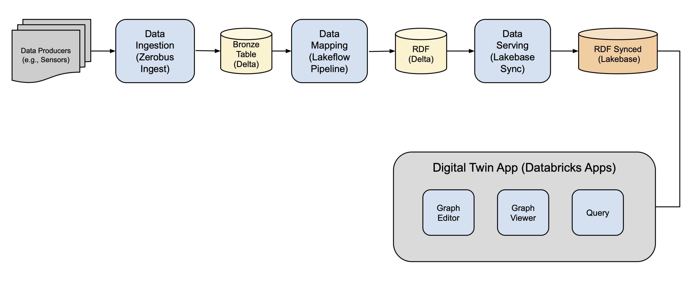

# Frozen Potato Digital Twin

An IoT Digital Twin for frozen potato manufacturing, built on the Databricks [Digital Twin Solution Accelerator](https://github.com/databricks-industry-solutions/digital-twin). This demo showcases real-time sensor ingestion via Zerobus, RDF-based knowledge graph mapping, low-latency serving with Lakebase, and an interactive Databricks App for monitoring factory operations.



## Architecture

```
Potato Factory Sensors (OPC UA / Ignition)
        |
        v
  [Zerobus Ingest]  ──>  [Delta Bronze Table]
                                  |
                           [R2R Mapping Pipeline]
                            (Spark Declarative)
                                  |
                                  v
                           [RDF Triples Table]
                                  |
                           [Synced Table ──> Lakebase]
                                  |
                           [Databricks App]
                            FastAPI + HTML/JS
                           (Digital Twin UI)
```

## Production Lines

| Line | Product | Processing Stages |
|------|---------|-------------------|
| 1 | French Fries | Washing > Peeling > Cutting > Blanching > Frying > IQF Freezing |
| 2 | Hash Browns | Washing > Peeling > Shredding > Forming > IQF Freezing |
| 3 | Wedges | Washing > Cutting > Seasoning > Frying > IQF Freezing |

**16 components** across 3 production lines, each with 6 sensor readings (oil temperature, water temperature, belt speed, freezer temperature, moisture content, product weight).

## Quick Start

### Prerequisites

- Databricks workspace with Unity Catalog and serverless compute
- Lakebase enabled on the workspace
- Zerobus enabled (for streaming ingest)

### 1. Configure parameters

Open `notebooks/0-Parameters.ipynb` and set your catalog, schema, warehouse ID, and Lakebase instance name.

### 2. Run notebooks in order

All notebooks run on **serverless compute** — no cluster required.

```
notebooks/0-Parameters.ipynb                  # Configuration
notebooks/1-Create-Sensor-Bronze-Table.ipynb  # Create Delta table + generate synthetic data
notebooks/2-Ingest-Data-Zerobus.ipynb         # Stream data via Zerobus
notebooks/3-Setup-Mapping-Pipeline.ipynb      # Deploy R2R mapping pipeline (sensor -> RDF triples)
notebooks/4-Sync-To-Lakebase.ipynb            # Create Lakebase instance + synced table
notebooks/5-Create-App.ipynb                  # Deploy the Databricks App
```

### 3. Access the app

After notebook 5 completes, the app URL will be printed. The app provides:
- **Dashboard** with KPI cards and status indicators
- **Graph Editor** for interactive RDF graph visualization
- **Telemetry** panel with live sensor readings
- **3D Viewer** for spatial factory visualization
- **RDF Editor** for managing ontology models
- **Alerts Center** and **Command Center** (SPARQL queries)

### 4. Cleanup

Run `notebooks/6-Cleanup.ipynb` to tear down all resources.

## Project Structure

```
frozen-potato-digital-twin/
├── notebooks/                    # Databricks notebooks (run in order)
│   ├── 0-Parameters.ipynb
│   ├── 1-Create-Sensor-Bronze-Table.ipynb
│   ├── 2-Ingest-Data-Zerobus.ipynb
│   ├── 3-Setup-Mapping-Pipeline.ipynb
│   ├── 4-Sync-To-Lakebase.ipynb
│   ├── 5-Create-App.ipynb
│   └── 6-Cleanup.ipynb
├── app/                          # Databricks App (FastAPI backend + HTML frontend)
│   ├── app.yaml                  # App configuration & resource bindings
│   ├── backend/main.py           # FastAPI server with all API endpoints
│   └── frontend/src/index.html   # Single-file frontend (Dashboard, Graph, Telemetry, 3D)
├── line_data_generator/          # Python module for synthetic sensor data generation
├── mapping_pipeline/             # Spark R2R pipeline (sensor data -> RDF triples)
├── zerobus_station/              # Zerobus Ignition Gateway module (see below)
├── zerobus_config/               # Zerobus SDK configuration & protobuf schema
├── example-ttls/                 # RDF/Turtle ontology definitions
├── images/                       # Architecture diagrams
├── databricks.yml                # Databricks Asset Bundle config
├── LICENSE
└── NOTICE
```

## Zerobus Integration

This demo uses [Zerobus](https://docs.databricks.com/) for real-time sensor data ingestion from factory floor systems.

### Zerobus Station (`zerobus_station/`)

A reference implementation of an **Ignition Gateway module** that streams OT (Operational Technology) data from Inductive Automation's Ignition platform into Databricks via Zerobus. Includes:

- **Pre-built module** (`releases/`) — ready to install in Ignition 8.1.x or 8.3.x
- **Source code** (`module/`) — Java/Gradle project for customization
- **Deployment guide** (`DEPLOYMENT.md`) — production runbook
- **Examples** (`examples/`) — demo tag scenarios for manufacturing, oil & gas, and renewables
- **Docker setup** (`docker/`) — run Ignition locally for testing
- **Onboarding notebooks** (`onboarding/`) — create Bronze tables and configure permissions

See `zerobus_station/README.md` for full documentation.

### Zerobus Config (`zerobus_config/`)

Simplot-specific configuration for the Zerobus ingest pipeline:

- `config.json` — table mapping and connection settings
- `tables/potato_sensors/schema.proto` — protobuf schema for frozen potato sensor data
- `.env.template` — credentials template

## Tech Stack

| Layer | Technology |
|-------|-----------|
| Ingestion | Zerobus (serverless, gRPC) |
| Storage | Delta Lake on Unity Catalog |
| Knowledge Graph | RDF/Turtle ontology + Spark R2R mapper |
| Serving | Lakebase (managed PostgreSQL) |
| App | Databricks Apps (FastAPI + HTML/CSS/JS) |
| Compute | 100% serverless |

## RDF Namespace

All RDF entities use the namespace `http://example.com/potato-factory/`. Component IRIs follow the pattern `http://example.com/potato-factory/component-{ID}` (e.g., `component-FF-WASH`, `component-HB-SHRED`, `component-WG-FRY`).

## License

See [LICENSE](LICENSE) and [NOTICE](NOTICE).
